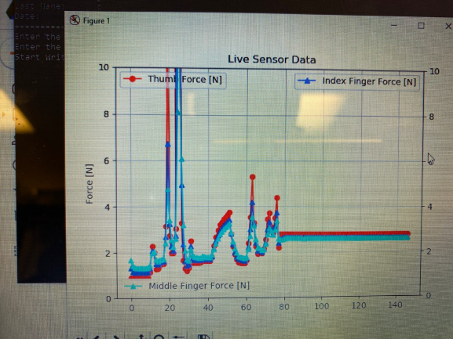

# Medical-Device-App-GUI
A Graphical User Interface (GUI) created for a medical device using Tkinter.

## Graphical User Interface
The following is the Graphical User Interface generated when the main file is run:  

## Sensor Data Visualization
The following is the Live Sensor Data when the user presses "START TEST":  

## Live Sensor Data - Video
A video of the GUI and the Live Sensor Data can be seen below:  
[Visualization Video](https://drive.google.com/file/d/1YbccYbmbtjgVYF3BjthzpnNtlAazklQg/view?usp=sharing)

## More Information
If you want more information about the medical device (College Capstone Design Project) look at the following project folder:  
[Project Folder](https://drive.google.com/drive/u/0/folders/1WpzN3x42i1R4fN0WCJqcu4nOuEURvMxr)
